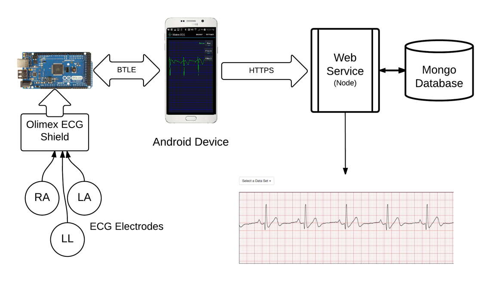

#ecgkit
An IoT-inspired Arduino Electrocardiograph Project
Riley Rainey, 2016

With an Arduino and inexepensive off-the-shelf shield, you can turn your Android device into an experimental ECG (EKG). Use this Android application, accompanying Arduino sketch, and Node.JS server code to collect and plot ECG data on your device and (soon) a server.

**The Architecture**
The Olimex ECG Shield is precalibrated to sense a heartbeat using standard electrodes. That input is fed into an Arduino A/D channel. A small Arduino sketch collects data and passes those via Bluetooth to your Android device for plotting. The Android application has the capability to upload the sampled data via an HTTPS RESTful API. Data on the server is stored in a Mongo database.

**Arduino and Bluetooth**
This application uses the xxxx USB/BT library. I chose the Arduino Mega ADK for this project because it has a built-in USB Host interface. This allows for Bluetooth connectivity using a BTLE USB dongle. Today, you can buy Arduino variants that include built-in Bluetooth hardware. Older Arduino models also might be able to leverage either a Bluetooth Shield or USB Host Shield, although none of those non-MegaADK configurations have been tested by me.

**Hardware Requirments**
- Android Device running Android 4.4.2 or later with Bluetooth

- [Arduino Mega ADK](https://www.arduino.cc/en/Main/ArduinoBoardMegaADK)  (any version; available from a number of sources)

- Bluetooth LE USB dongle - to connect from the Arduino ADK to the phone/tablet

- [Olimex ECG Shield](https://www.olimex.com/Products/Duino/Shields/SHIELD-EKG-EMG/) - model ID SHIELD-EKG-EMG (I ordered from Digi-key).

- Electrodes and cabling - Olimex also produces some covenient electrode cabling for use with their shield: mode ID [SHIELD-EKG-EMG-PRO](https://www.olimex.com/Products/Duino/Shields/SHIELD-EKG-EMG-PRO/). This particular cable requires disposable ECG Electrodes (I ordered these from Cables and Sensors).
- (optional) A Linux/OS X/Windows server capable of running Node.JS and Mongo DB.

**Directory Structure**

<code>src/android/MakerECG</code>- Android Studio project

<code>src/arduino</code>- Arduino sketch

<code>src/server/ecgsvc</code>- Node.JS based web service for uploading data sets

**Arduino Build Notes**
Built using Arduino tools 1.6.7

Download the Google Accessory Development Kit 2011 edition

http://developer.android.com/tools/adk/adk.html

https://dl-ssl.google.com/android/adk/adk_release_20120606.zip

**Android Build Notes**
Using Android Studio 1.5.1

**Server**